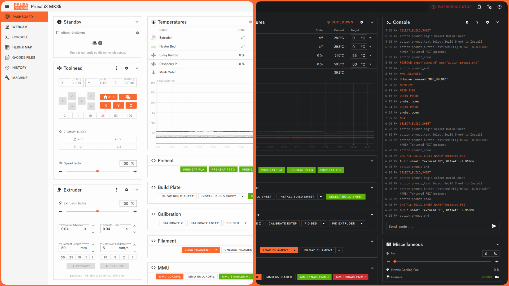

# mainsail-printables
A Mainsail dark theme with orange accents designed to mimick the look of the Printables website (dark mode only).


## Installation
1. Clone the files from this repo:
```bash
git clone https://github.com/8bitmcu/mainsail-printables ~/printer_data/config/.theme
```
2. Go to ***Settings*** and set ***Mode*** to dark.
3. Go to ***Settings*** -> ***UI-Settings*** and set ***Logo*** and ***Primary*** color to `250, 104, 49`. 
4. Optionally set the colors of your extruder and heated bed to #cb2c2c (red), #5daf0b (green) and #3f4143 (gray)

## Preview

